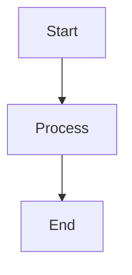

# RAVANA AGI Documentation System

A modern, responsive documentation system for the RAVANA AGI platform built with Next.js and Tailwind CSS.

The source code for this project is available on [GitHub](https://github.com/OpenSource-Syndicate/RAVANA).

## Features

- **Modern UI/UX**: Clean, responsive design with dark/light mode support
- **Enhanced Typography**: Improved readability with proper font sizing and line spacing
- **Collapsible Navigation**: Organized sidebar with collapsible sections
- **Sticky Table of Contents**: Easy navigation with expandable sections
- **Callout Boxes**: Special formatting for notes, warnings, and tips
- **Syntax Highlighting**: Code snippets with Prism.js
- **Mermaid Diagrams**: Support for diagrams and flowcharts
- **Mobile Responsive**: Fully responsive design for all devices
- **Animations**: Smooth transitions and interactive elements
- **Search Functionality**: Easy document discovery

## Project Structure

```
/wiki-nodejs/
├── components/             # UI components
├── lib/                    # Markdown processing utilities
├── pages/                  # Next.js routes
├── scripts/                # Debugging tools
├── styles/                 # CSS styling
├── docs/                   # Markdown documentation
└── public/                 # Static assets
```

## Getting Started

1. Clone the repository
2. Install dependencies: `npm install`
3. Run development server: `npm run dev`
4. Build for production: `npm run build`
5. Start production server: `npm run start`

## Documentation Guidelines

### Creating New Documents

1. Add markdown files to the `/docs` directory
2. Use proper heading hierarchy (#, ##, ###, etc.)
3. Include frontmatter for titles if needed

### Callout Boxes

Use special syntax to create callout boxes:

```
> [!NOTE]
> This is a note callout box with important information.

> [!WARNING]
> This is a warning callout box for critical information.

> [!TIP]
> This is a tip callout box with helpful advice.
```

### Code Blocks

Use triple backticks with language specification:

```javascript
console.log('Hello, world!');
```

### Mermaid Diagrams

Use mermaid code blocks for diagrams:



## Customization

### Theme Colors

The system uses a dark theme by default with light theme support. Colors can be customized in `tailwind.config.js`.

### Typography

Font sizes and line heights are defined in `styles/globals.css`. The primary font is Inter, and monospace font is Roboto Mono.

## Deployment

The documentation system is designed for static export and can be deployed to any static hosting service. GitHub Pages deployment is configured via GitHub Actions.

## Contributing

1. Fork the repository
2. Create a feature branch
3. Commit your changes
4. Push to the branch
5. Create a pull request

## License

MIT License - see LICENSE file for details.